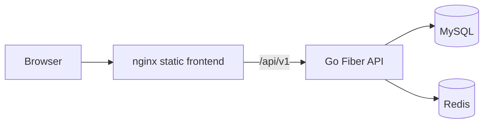

# Libro Monorepo

Libro is a production-ready personal reading tracker with a Go/Fiber backend and a React/Vite frontend.

## Features

- Account auth (register/login/refresh/logout).
- Reading dashboard with analytics, insights, goals, and sessions.
- Library management with status/progress/notes.
- Wishlist management with purchase links.
- Health/readiness endpoints for platform orchestration.
- JSON structured request + error logging for observability.

## Architecture Diagram



## Screenshots

> Replace these with runtime screenshots from your environment if desired.


## Repo Layout

```text
.
├── backend/                # Go/Fiber API
├── frontend/               # React/Vite SPA
├── .github/workflows/      # CI pipelines
├── docker-compose.yml      # local dev compose
└── docker-compose.prod.yml # production-style compose
```

## Production Deployment

### Backend image

- Multi-stage build (`backend/Dockerfile`).
- Compiles static Go binary (`CGO_ENABLED=0`) and copies it into a distroless runtime image.

### Frontend image

- Builds static assets in Node.
- Serves `/dist` via nginx (`frontend/nginx.conf`) with SPA fallback and static asset caching.

### Run production-style stack

```bash
docker compose -f docker-compose.prod.yml up --build -d
```

## Local Developer Experience

```bash
# One command for both apps + infra
docker compose up --build

# Or run without docker
make build
make test
make lint
```

`docker-compose.yml` intentionally uses `Dockerfile.dev` images to preserve quick feedback for local development.

## Seed Data (Demo Readiness)

A demo dataset is available at `backend/seeds/seed.sql`.

```bash
# Example
docker compose exec -T mysql mysql -uroot -proot libro < backend/seeds/seed.sql
```

Seed includes:
- demo user
- sample books across statuses
- wishlist and purchase link
- reading goals and sessions

## Observability

- Request logging middleware emits structured JSON logs.
- Centralized Fiber error handler logs failure context and request ID.
- Operational probes:
  - `GET /health`
  - `GET /ready`

## CI/CD

GitHub Actions workflows:
- Frontend: install, lint, test (`.github/workflows/frontend-ci.yml`)
- Backend: `golangci-lint` + `go test` (`.github/workflows/backend-ci.yml`)

Pipelines are scoped by path filters and dependency caching for faster PR checks.
