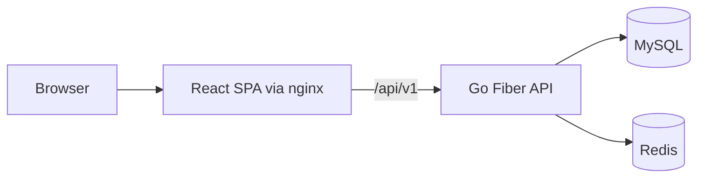

# Libro

Libro is a reading-tracker monorepo built for teams who want a practical, production-oriented full-stack baseline: a Go/Fiber API, a React/Vite web app, Dockerized infra, and CI checks.

## 1) Project overview

Libro helps users track their reading journey across books, sessions, goals, wishlist items, and profile preferences. It emphasizes fast iteration for product teams while keeping deployment and operations straightforward.

## 2) Product purpose

The app supports a complete personal reading workflow:
- Account registration and login.
- Library organization by reading status.
- Reading progress, goals, and recent sessions.
- Wishlist management with purchase links.
- Profile management and reminder settings.

## 3) Key features

- JWT auth with access/refresh token flow.
- Dashboard summary + analytics + insights endpoints.
- CRUD flows for books, notes, wishlist items, and links.
- Reading session + goal tracking.
- Structured JSON logging with request correlation.
- Health/readiness probes for orchestration.

## 4) Tech stack

### Backend
- Go 1.24
- Fiber v2
- GORM
- MySQL
- Redis
- Zap logging

### Frontend
- React 18
- TypeScript
- Vite
- Zustand
- TanStack Query
- Axios
- TailwindCSS
- Vitest + Testing Library

### Platform
- Docker / Docker Compose
- GitHub Actions CI

## 5) Architecture overview



## 6) Repository structure

```text
.
├── backend/                  # Go API
│   ├── controllers/
│   ├── services/
│   ├── repositories/
│   ├── middleware/
│   ├── pkg/
│   ├── migrations/
│   └── tests/
├── frontend/                 # React SPA
│   ├── src/features/
│   ├── src/pages/
│   ├── src/components/
│   ├── src/shared/
│   └── src/api/
├── .github/workflows/        # CI jobs
├── docker-compose.yml        # local/dev stack
├── docker-compose.prod.yml   # prod-style stack
└── Makefile
```

## 7) Setup prerequisites

- Docker + Docker Compose **or**
- Local toolchain:
  - Go 1.24+
  - Node 20+
  - npm 10+
  - MySQL 8+
  - Redis 7+

## 8) Environment variables

Use root `.env.example`, backend `backend/dev.env`, and frontend `frontend/.env.example` as references.

### Backend required
- `APP_PORT`
- `APP_ENV` (`development` or `production`)
- `LOG_LEVEL` (optional; examples: `debug`, `info`, `warn`, `error`)
- `JWT_SECRET` (minimum 32 chars)
- `ACCESS_TOKEN_TTL`
- `REFRESH_TOKEN_TTL`
- `AUTH_RATE_LIMIT_WINDOW`
- `AUTH_RATE_LIMIT_MAX`
- `MYSQL_HOST`
- `MYSQL_PORT`
- `MYSQL_USER`
- `MYSQL_PASSWORD`
- `MYSQL_DATABASE`
- `REDIS_ADDR`
- `REDIS_PASSWORD` (optional)
- `REDIS_DB`
- `FRONTEND_URL`

### Frontend required
- `VITE_API_URL` (defaults to `/api/v1` if unset)

## 9) Local development instructions

### With Docker (recommended)

```bash
docker compose up --build
```

### Without Docker

```bash
# backend
cd backend
go run main.go

# frontend
cd frontend
npm ci
npm run dev
```

## 10) Docker instructions

### Local/dev compose
```bash
docker compose up --build
```

### Production-style compose
```bash
docker compose -f docker-compose.prod.yml up --build -d
```

## 11) Production-style run instructions

- Build backend with `backend/Dockerfile` (distroless runtime).
- Build frontend static assets and serve from nginx.
- Route frontend `/api/v1` to backend container.
- Use a real secret store for env vars in production.

## 12) Backend overview

Layering follows `controllers -> services -> repositories`:
- **Controllers**: parse/validate request, shape response.
- **Services**: business logic and orchestration.
- **Repositories**: persistence and query concerns.
- **Middleware**: auth, request context, request logging.
- **pkg/logger**: centralized Zap logger bootstrap.

## 13) Frontend overview

- Route-driven pages in `src/pages`.
- Domain-oriented APIs/hooks under `src/features`.
- Shared query/auth/theming providers under `src/shared`, `src/contexts`, `src/theme`.
- Axios client with access-token injection and refresh retry strategy.

## 14) Database and Redis notes

- MySQL stores users, books, notes, goals, sessions, wishlist, and purchase links.
- Redis stores refresh-token state and auth rate-limit counters.

## 15) Seed/demo instructions

A starter dataset exists at `backend/seeds/seed.sql`.

```bash
docker compose exec -T mysql mysql -uroot -proot libro < backend/seeds/seed.sql
```

## 16) Testing instructions

### Backend
```bash
cd backend
go test ./...
```

### Frontend
```bash
cd frontend
npm test -- --run
```

## 17) Lint/format instructions

### Backend
```bash
cd backend
gofmt -w .
golangci-lint run
```

### Frontend
```bash
cd frontend
npm run lint
npm run format
```

## 18) CI overview

Workflows in `.github/workflows/`:
- `backend-ci.yml`: Go lint + tests.
- `frontend-ci.yml`: npm install + lint + tests.

## 19) Troubleshooting

- **401 loops / forced logout**: verify refresh token expiry and backend `JWT_SECRET` consistency.
- **CORS errors**: confirm `FRONTEND_URL` matches your frontend origin.
- **DB connection failure**: confirm MySQL host/port/user/password and migration state.
- **Redis auth issues**: verify `REDIS_PASSWORD` and `REDIS_DB`.

## 20) Screenshots

> Replace placeholders with real screenshots from your environment.

- Landing page: `docs/screenshots/landing.png`
- Dashboard: `docs/screenshots/dashboard.png`
- Library: `docs/screenshots/library.png`
- Wishlist: `docs/screenshots/wishlist.png`

## 21) Contribution guidance

1. Create a focused feature/fix branch.
2. Keep changes incremental and reviewable.
3. Run lint/tests locally before opening a PR.
4. Include migration notes if schema-affecting changes are introduced.
5. Avoid committing secrets or personal data.

## 22) Roadmap / future improvements

- Add OpenAPI generation + endpoint contract tests.
- Expand integration tests around auth and token refresh edge cases.
- Add metrics/tracing (Prometheus + OTel).
- Add role-based authorization and audit events.
- Improve deployment docs for Kubernetes and managed services.
